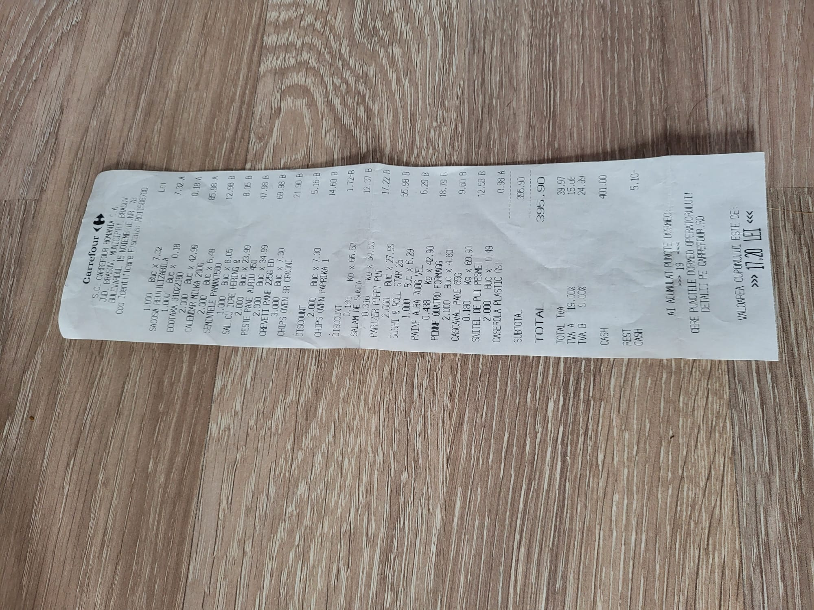
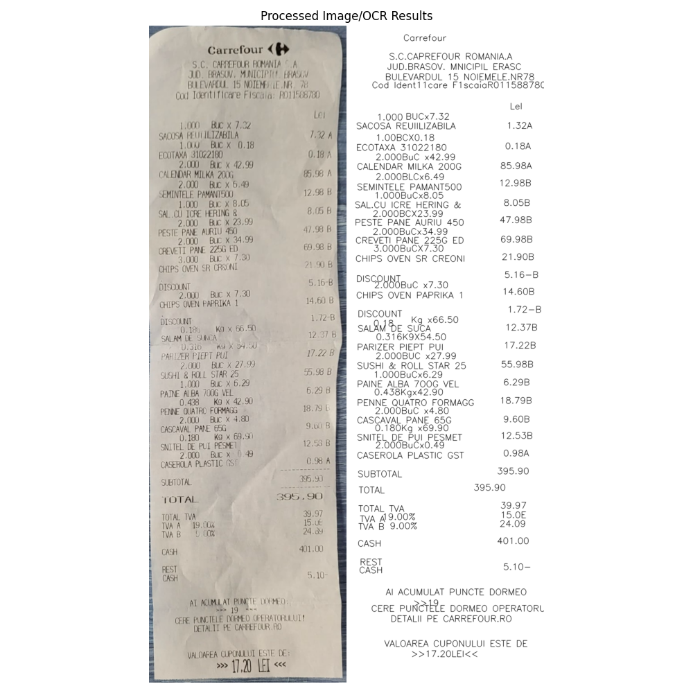

# Receipt-OCR

A Python-based tool for receipt recognition and text extraction using computer vision and OCR techniques.

## Overview

Receipt-OCR is designed to:
1. Automatically detect and extract receipt contours from images
2. Apply perspective transformation to get a top-down view of receipts
3. Perform Optical Character Recognition (OCR) on the receipt to extract text content

## Features

- Receipt edge detection using computer vision techniques
- Perspective correction for skewed receipt images
- Text extraction using PaddleOCR
- Visualization tools for OCR results
- Log generation with timestamp for OCR results

## Setup

### 1. Create and activate a Conda environment

```bash
# Create the environment
conda create -n receipt_ocr python

# Activate the environment
conda activate receipt_ocr
```

### 2. Install dependencies

```bash
# Install PaddlePaddle
pip install paddlepaddle -i https://pypi.tuna.tsinghua.edu.cn/simple

# Install PaddleOCR
pip install "paddleocr>=2.0.1"

# Install additional dependencies
pip install -r requirements.txt
```

## Input Example

In order for the preprocessing feature (`-pp` flag), to work please ensure that the image is well-lit and that the edges of the receipt are clearly visible and detectable within the image as seen in the example bellow.



Note that if the edges can't be seen in the image the project will crash with the preprocessing turned on but it should still work well without the processing activated.

The preprocessing will:
1. Detect the receipt edges in the image
2. Apply perspective transformation to get a top-down view
3. Then perform OCR on the corrected image

This is especially useful for receipts photographed at an angle.

## Output Example



## Usage

```bash
# Basic usage with image path
python src/receipt_ocr.py -img path/to/receipt/image.jpg

# Enable preprocessing (contour detection and perspective transformation)
python src/receipt_ocr.py -img path/to/receipt/image.jpg -pp

# Enable visualization of results
python src/receipt_ocr.py -img path/to/receipt/image.jpg -v

# Save logs to a specific folder
python src/receipt_ocr.py -img path/to/receipt/image.jpg -log path/to/logs/folder

# Complete usage example
python src/receipt_ocr.py -img path/to/receipt/image.jpg -pp -v -log path/to/logs/folder
```

### Command-line Arguments

- `-img, --image_path`: Path to the receipt image file
- `-v, --view`: Display images and visualization of results
- `-pp, --pre_process`: Apply preprocessing to the image (contour detection and perspective correction)
- `-log, --log_path`: Path to folder where logs will be saved (default: './logs')

### Log Format

The script generates timestamped log files (log_YYYYMMDD_HHMMSS.txt) containing:
1. Input image path
2. OCR results

## License

This project is licensed under the MIT License - see the [LICENSE](LICENSE) file for details.
